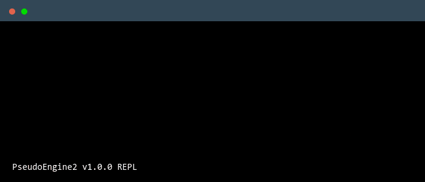

# PseudoEngine 2

A pseudocode interpreter designed to be compatible with the Cambridge IGCSE and A level [pseudocode syntax](./Syntax.md)



## The REPL
The REPL stands for **R**ead **E**xecute **P**rint **L**oop and is an interface where pseudocode statements can be entered. The statement is immediately executed after it is entered and the result or potential errors are printed to the console to make it easy for debugging.

```
> 5 + 2 * 3
11
> LEFT("ABCD", 2)
"AB"
> x <- 1 / 0

Runtime Error in file <stdin>:
Division by 0

Traceback:
Program, line 1, column 9
```

## Usage
### Launching the REPL
Lanuch the program directly by double clicking the [executable](https://github.com/SingularityT3/PseudoEngine2/releases) \
**OR** \
Run it in the terminal with no arguements

### Running files in the REPL
The REPL can be used to run files using `RUNFILE <file>`. \
For example, here is a simple hello world program stored in the file `hello.pseudo`
```
OUTPUT "Hello World!"
```
\
Run it with `RUNFILE hello.pseudo` \
Example output:
```
> RUNFILE hello.pseudo
==> Running file 'hello.pseudo'
Hello World!

==> Program exited successfully
> 
```
> Tip:
> The program must be stored in the _same folder_ as the executable **or** the full path of the program has to be mentioned when using `RUNFILE`


### Running files from the terminal
Navigate to the executable and run it providing the path of the program file as an arguement similar to `RUNFILE`

Windows:
```
PseudoEngine2.exe <filepath>
```
Linux/Unix:
```
./PseudoEngine2 <filepath>
```

Make sure you replace `PseudoEngine2` with the actual name of the executable or rename the executable

## Examples
See [examples](./examples)

## Building
Make sure cmake and a c++ compiler is installed, then clone the repository and inside its folder run the following commands:
```
cmake -B build -DCMAKE_BUILD_TYPE=Release
cmake --build build --config Release
```
The executable will be generated inside the build folder
