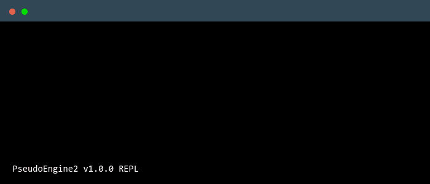

# PseudoEngine 2

A pseudocode interpreter designed to be compatible with the Cambridge IGCSE and A level [pseudocode syntax](./Syntax.md)



## The REPL
The REPL stands for **R**ead **E**xecute **P**rint **L**oop. It's an interactive interface where you can type pseudocode statements one by one. Each statement is immediately run, and the result or any errors are shown right away. This is helpful for quickly testing small pieces of code and experimenting with syntax without needing to create a full file.

```
> OUTPUT "Hello World!"
Hello World!
> 5 + 2 * 3
11
> LEFT("ABCD", 2)
"AB"
> x <- 1 / 0

Runtime Error in file <stdin>:
Division by 0

Traceback:
Program, line 1, column 9
```

## Usage
### Launching the REPL
Lanuch the program directly by double clicking the [executable](https://github.com/SingularityT3/PseudoEngine2/releases) \
**OR** \
Run it in the terminal with no arguments

### Running files in the REPL
The REPL can be used to run files using `RUNFILE <file>`. \
For example, here is a simple hello world program stored in the file `hello.pseudo`
```
OUTPUT "Hello World!"
```
You can run it like this:
```
> RUNFILE hello.pseudo
==> Running file 'hello.pseudo'
Hello World!

==> Program exited successfully
> 
```
> **Tip:** For `RUNFILE` to work easily, place your `.pseudo` file in the same folder as the `PseudoEngine2` executable. Otherwise, you'll need to provide the full path to your file (e.g., `RUNFILE /path/to/your/hello.pseudo`).


### Running files directly from the terminal
You can also run a pseudocode file directly when you launch PseudoEngine2 from the terminal.

Navigate to where your `PseudoEngine2` executable is, and provide the path to your pseudocode file as an argument:

Windows:
```
PseudoEngine2.exe <filepath/your_program.pseudo>
```
Linux/Unix:
```
./PseudoEngine2 <filepath/your_program.pseudo>
```

Make sure you replace `PseudoEngine2` with the actual name of the executable or rename the executable

## Example programs
See [examples](./examples)

## Building from source
Make sure cmake and a c++ compiler is installed, then clone the repository and inside its folder run the following commands:
```
cmake -B build -DCMAKE_BUILD_TYPE=Release
cmake --build build
```
The executable will be generated inside the build folder
